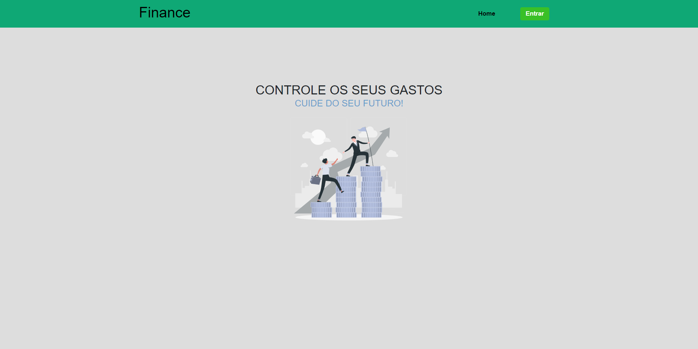
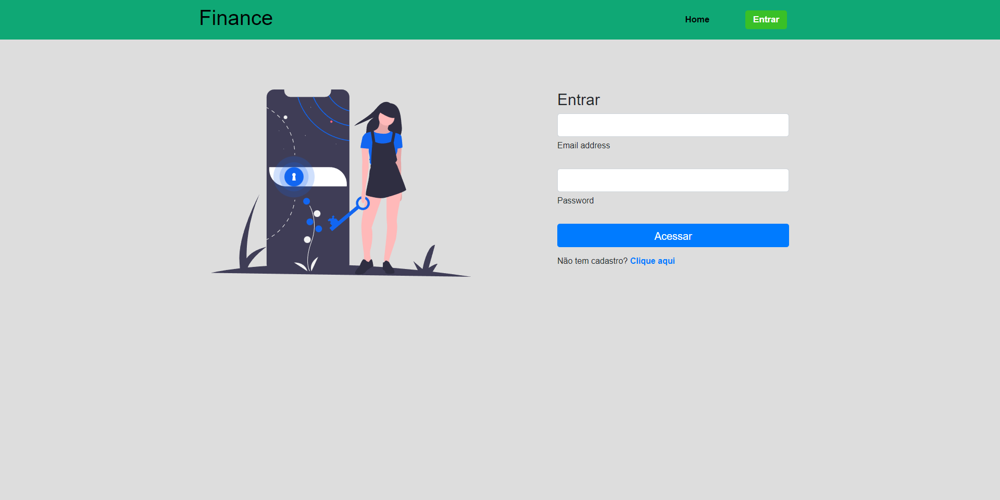
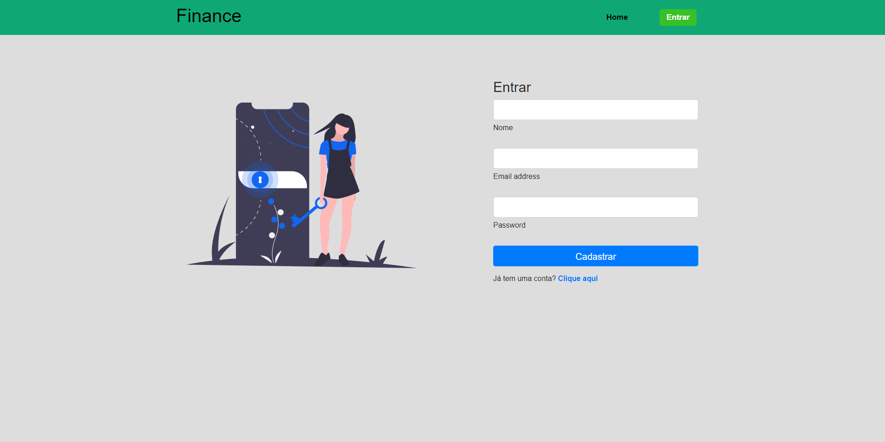
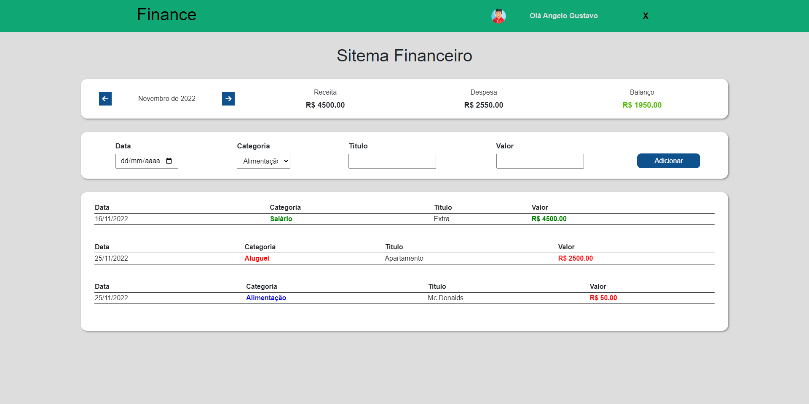
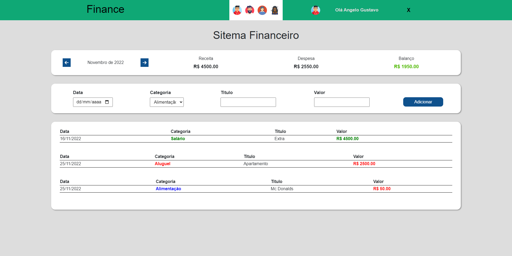

## 🔗 Sobre o Projeto

Esse projeto está sujeito a melhorias.

[Clique aqui e veja o deploy](https://financeapp-hiroto.netlify.app/)

Esse é um projeto de um app web de finanças. Entre fazendo login, ou caso não tenha uma conta, vá até a página register e faça o seu cadastro.

## 💻 Pagina Home
 

## 💻 Página de login

## 💻 Página de cadastro

## 💻 Dashboard

A página dashboard é aonde você vai conseguir testar o projeto, adicionando novas finanças na lista..

 

## 💻 Troque a imagem de perfil

Escolha um avatar de perfil que melhor te agrada. É só clicar na imagem de perfil e escolher o seu favorito.

 

 

## 👨‍💻 Tecnologias utilizadas
 

- Javascript
- React Js
- SASS
 

## 🎮 Implantação em produção

- Web de front-end: Netlify
- Flexbox
- Hooks

## 📓 Bibliotecas Utilizadas

- Font Awesome
- Animated CSS burguers
- React Router Dom
- Bootstrap
- Toastify
 

## 🧑 Autor
 

Ângelo Gustavo Pereira da Silva

Linkedin: www.linkedin.com/in/souangelogustavo

E-mail: angelotj43@gmail.com

